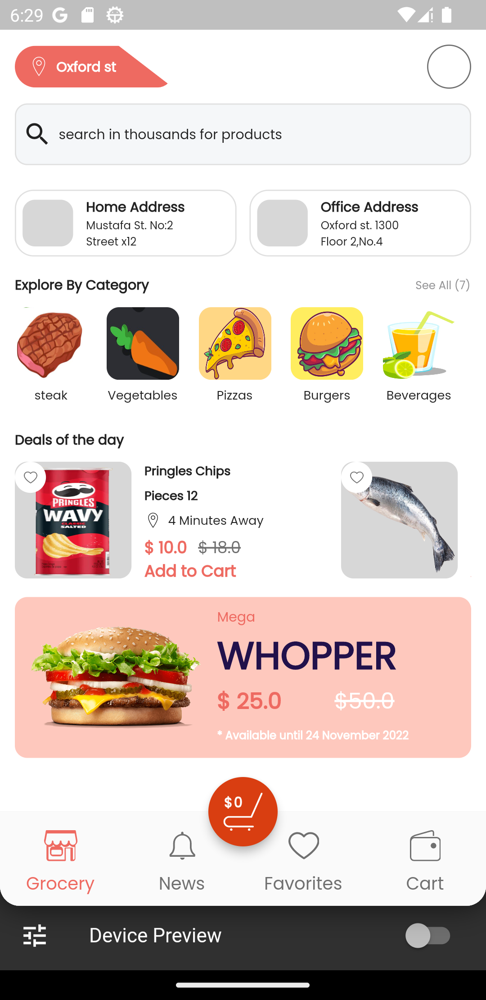
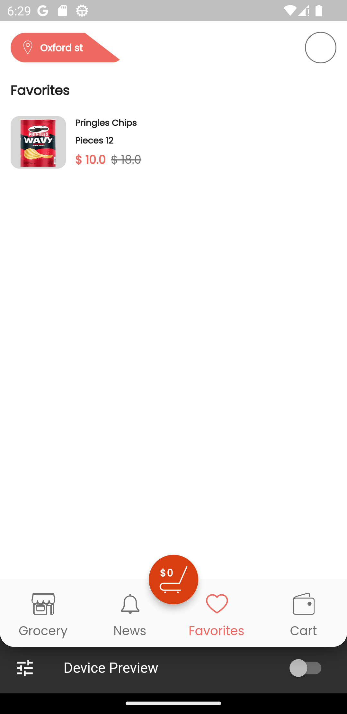
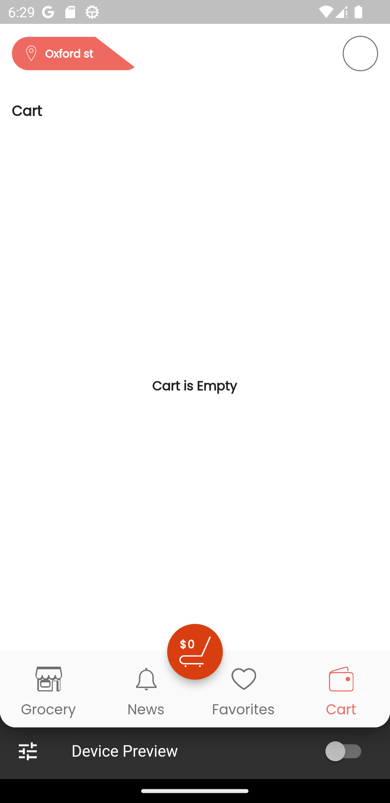

# flutter_task_app

flutter e_commerce application built with getx as state managment and dependency managment.

<h1>screenshots</h1>

<h2>Home screen</h2> 
</img>

<h2> favorites screen </h2>
</img>

<h2> cart screen <h2>
</img>

<h2> cart empty <h2>
</img>

<h2> favorites empty <h2>
</img>
